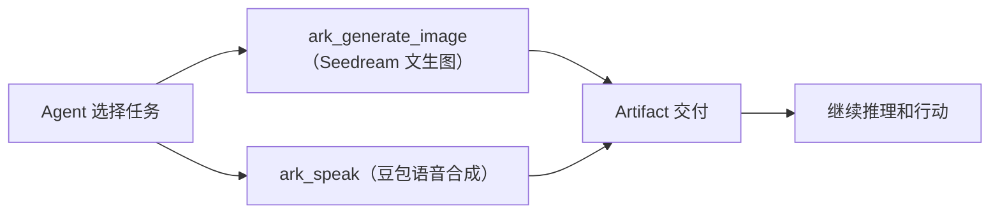

<div align="center">

# DSH Ark Toolkit

[](LICENSE)
[](cordis.patch.yml)

**给 DeepSeek Harness 接上字节的生成能力：豆包 Seedream 文生图，加上豆包语音合成（TTS）。**

🚀 一句提示词出图 ｜ 原生 TypeScript 实现 ｜ 字节火山方舟 ｜ 开箱即用

[亮点](#亮点) ｜ [快速开始](#快速开始三步完成) ｜ [工具一览](#工具一览) ｜ [配置与限制](#配置与限制) ｜ [常见问题](#常见问题) ｜ [开发与社区](#开发与社区)

</div>

> **看图不用装插件。** DSH 0.1.5 起 DeepSeek 模型已经原生支持图片输入（`inputModalities` 含 `image`），识图、OCR、多图对比直接交给模型即可。Ark Toolkit 从 0.1.0 起只负责**生成图片**和**合成语音**。

## 亮点

- **豆包 Seedream 文生图。** 内置 `ark_generate_image` 工具，直接用字节 Seedream 模型生成图片并交付为 Artifact，支持 1K/2K/3K/4K 分辨率、宽高比、反向提示词与模型别名。
- **字节 TTS 语音合成。** `ark_speak` 工具把文本变成语音（MP3/OGG/PCM/WAV），使用字节豆包语音合成模型 2.0，交付为工作区音频 Artifact（可用"打开文件"或结果里的路径访问）。
- **原生 TypeScript，开箱即用。** 两个工具都直接调用字节服务的 HTTP 接口，图片尺寸探测使用 Node 原生方案（sharp），安装后即可使用。
- **默认接入字节火山方舟。** 在 **设置 → 插件** 里打开 `Volcengine Ark Toolkit` 页面，填入你自己的 Ark API Key 即可。

> **安装即可使用。** 把火山方舟 API Key 保存为 `ARK_API_KEY` 这个 DSH Credential，把火山引擎语音合成 Token 保存为 `VOLCENGINE_TTS_KEY`。

> **已发布到 npmjs，一行安装即可**（安装详情见 [安装与配置指南](docs/installation.md)）：

```sh
dsh plugin --profile web add @nextnowlabs/dsh-ark-toolkit
```

**目录**

- [亮点](#亮点)
- [适合谁用](#适合谁用)
- [快速开始：三步完成](#快速开始三步完成)
- [工具一览](#工具一览)
- [工作原理](#工作原理)
- [配置与限制](#配置与限制)
- [常见问题](#常见问题)
- [开发与社区](#开发与社区)
- [许可证](#许可证)

## 适合谁用

1. 想直接在对话里生成图片：海报、插画、图标、示意图。
2. 想把一段文字变成可播放、可下载的语音。

随附的 `ark-skills` Skill 会告诉 Agent 何时用哪个工具，以及如何处理远程服务返回的内容。

## 快速开始：三步完成

> 详细的安装、火山方舟/TTS 配置与完整字段参考见 [安装与配置指南](docs/installation.md)。

### 1. 安装

插件已发布到 npmjs，通过 `dsh` CLI 一行安装到 Web Profile：

```sh
dsh plugin --profile web add @nextnowlabs/dsh-ark-toolkit
```

Headless Profile 同样安装：

```sh
dsh plugin --profile headless add @nextnowlabs/dsh-ark-toolkit
```

> 若默认 registry 为镜像源导致安装失败，可显式指定官方源：`dsh plugin --profile web add @nextnowlabs/dsh-ark-toolkit --registry=https://registry.npmjs.org/`。
> 源码贡献者如需本地开发，可克隆仓库后用本地路径安装：`dsh plugin --profile web add "$PWD"`。
>
> **版本要求：DSH `0.1.7-alpha.1` 及以上。** 0.1.7 重构了插件配置（插件在 profile 补丁里的那一行 `config` 就是它的设置，按 profile entry id 读写；旧的 `settings.yaml` 与插件设置命名空间已下线），本插件 0.1.2 起跟随该模型；在 0.1.6 及更早的 DSH 上加载会报 `ctx.settings.register is not a function`。

### 2. 重启并确认

重启正在运行的 Web Profile，在 **设置 → 插件** 里打开 **Volcengine Ark Toolkit** 页面。默认已配置字节火山方舟（Volcengine Ark）端点；在 **API key** 里填入你的 Ark Key（保存为 `ARK_API_KEY` 凭据）后点 **Save and apply**，再运行 **Test API connection** 确认连接。

### 3. 直接说你要做什么

调用 `/ark-skills`，然后例如：

```text
用豆包 Seedream 生成一张戴帽子的橘猫插画。
生成一张 16:9 的山景日落图，2K 分辨率。
把这句中文读出来。
```

## 工具一览

插件提供 2 个可以单独调用、也可以组合使用的工具：

| 工具 | 最适合解决的问题 | 主要结果 |
| --- | --- | --- |
| `ark_generate_image` | "用字节 Seedream 生成一张图" | PNG/JPEG Artifact、宽高与格式 |
| `ark_speak` | "用字节 TTS 把文本变成语音" | MP3/OGG/PCM/WAV 音频 Artifact |

## 工作原理

插件把生成任务交给配置的字节服务，本地只做必要的文件落盘与尺寸探测。

- `ark_generate_image` 走 OpenAI 兼容 `/images/generations`（Ark），把提示词、分辨率与宽高比发给 Seedream，再把返回的图片（URL 或 base64）写成工作区产物。
- `ark_speak` 走火山引擎语音技术的 TTS V3 单向 SSE 接口，逐块拼接音频后写成工作区产物。
- 生成图片的宽高与格式由 sharp 在本地探测，用于回报结果与构造 Artifact 描述。
- 远程服务返回的文本与元数据都属于**不可信内容**，模型不会把它们当作指令执行。



## 配置与限制

> 完整配置字段速查、Profile patch 示例和常见配置问题见 [安装与配置指南](docs/installation.md)。

### 默认使用字节火山方舟

默认配置只使用字节的服务：

```text
Base URL: https://ark.cn-beijing.volces.com/api/v3
模型（文生图）: doubao-seedream-5-0-260128（Seedream）
API Key: 你自己的火山方舟 Key，保存为 DSH Credential `ARK_API_KEY`
```

`ark_generate_image` 工具走 `/images/generations`，使用字节 Seedream 模型。Seedream 别名：`seedream-5.0-pro`、`seedream-5.0-lite`（默认）、`seedream-4.5`、`seedream-4.0`。

### 配置自己的火山方舟 API Key

在 **设置 → 插件** 的 **Volcengine Ark Toolkit** 页面里填写你的火山方舟 API Key，插件会保存为 DSH Credential（默认名 `ARK_API_KEY`），Key 无论在页面还是配置里都不会回显。页面读写的配置就是 profile 补丁里 `id: ark-toolkit` 那一行的 `config`（DSH 0.1.7 起没有第二处存储），一次保存是一次带版本栅栏的原子写入，保存后 runtime 会就地重建，无需重启 Profile。

**火山方舟图文教程：** [申请火山方舟 API Key，并用豆包 Seedream 生成图片](docs/ark-doubao.md)。教程包含账号与 Key 获取截图、Ark Toolkit 的准确配置，以及可直接使用的 cURL 示例。

也可以在 Profile patch 中配置：

```yaml
- id: ark-toolkit
  config:
    provider:
      baseUrl: https://ark.cn-beijing.volces.com/api/v3
      credential: ARK_API_KEY
```

### 配置 TTS 语音合成（ark_speak）

`ark_speak` 工具走火山引擎语音技术的 TTS V3 接口（`openspeech.bytedance.com` 单向 SSE 流式），默认使用豆包语音合成模型 2.0（资源 ID `seed-tts-2.0`）。它使用独立的 TTS Key（App Token），与上面的 Ark API Key 不同：

| 字段 | 默认值 |
| --- | --- |
| TTS 端点 | `https://openspeech.bytedance.com/api/v3/tts/unidirectional/sse` |
| DSH Credential | `VOLCENGINE_TTS_KEY`（火山引擎控制台 → 语音技术 → 应用 → Token） |
| 资源 ID（App ID） | `seed-tts-2.0` |
| 默认音色 | `zh_female_shuangkuaisisi_uranus_bigtts`（爽快思思 2.0） |

按上面的表把 TTS Token 保存为 `VOLCENGINE_TTS_KEY` 这个 DSH Credential 即可使用。想换端点/资源/默认音色，或改凭据名，可在 Profile patch 中配置：

```yaml
- id: ark-toolkit
  config:
    provider:
      tts:
        baseUrl: https://openspeech.bytedance.com/api/v3/tts/unidirectional/sse
        credential: VOLCENGINE_TTS_KEY
        resource: seed-tts-2.0
        voice: zh_female_shuangkuaisisi_uranus_bigtts
```

调用时还可以通过参数临时指定音色、格式（`mp3`/`ogg_opus`/`pcm`/`wav`）、采样率、语速、音量、音调、情感（`happy`/`sad`/`neutral`）和语言（`zh-cn`/`en`/`ja`）。完整音色列表见火山引擎官方《在线音色列表》（如 Vivi 2.0、小何 2.0、Tim 等）。

**设置 → 插件 → Volcengine Ark Toolkit** 页面还可以调整超时、并发、凭据名与端点（折叠在 **Advanced settings** 里）。

## 常见问题

| 问题 | 处理方式 |
| --- | --- |
| 方舟返回 401/403 | 确认 `ARK_API_KEY` 已保存且没有多余空格；在火山引擎控制台 **API Key 管理** 重新创建 |
| 模型不存在或未开通 | 到火山方舟 **模型广场** 开通对应 Seedream 模型；模型 ID 以控制台为准 |
| 火山方舟返回 429/限流 | 按错误信息等待后重试；或在火山引擎控制台查看配额并升级额度 |
| 自定义 Credential 缺失 | 在 **设置 → 插件 → Volcengine Ark Toolkit** 页面里填写 API Key，并确认 Credential 名称与配置一致 |
| 产物无法预览 | 使用"打开文件"或结果中的工作区路径；预览 URL 只在 Web 路由可用时存在 |
| 想生成图片却提示工具不存在 | 重启 Web Profile 并刷新页面，确认已加载 `/ark-skills`；卡片里应显示运行时就绪 |
| 启动日志报 `ctx.settings.register is not a function` | 插件版本落后于 DSH：升级到 0.1.2 及以上（`dsh plugin --profile web add @nextnowlabs/dsh-ark-toolkit@latest`），它适配 DSH 0.1.7 的 entry 作用域配置模型 |
| 页面显示"配置不可用"，但工具能用 | 该 Profile 没挂载 settings 服务，或插件不是从 profile 补丁行加载的；Ark 工具本身不依赖它，改配置请直接编辑该行的 `config` |

**接入生成服务会显著增加成本吗？**

不会。每次调用只把当前提示词或文本发给字节服务，调用之间不会累积上下文，因此额外成本很小。默认的 Seedream 与豆包语音合成都按量计费；想进一步降低成本，可以在火山引擎控制台关注免费额度或选购更经济的模型版本。

## 开发与社区

- 贡献前请阅读 [CONTRIBUTING.md](CONTRIBUTING.md)。
- Bug、功能建议和使用问题请提交到 [GitHub Issues](https://github.com/nextnowlabs/dsh-ark-toolkit/issues)；渠道说明见 [SUPPORT.md](SUPPORT.md)。
- 安全漏洞请按 [SECURITY.md](SECURITY.md) 私下报告。
- 版本变化见 [CHANGELOG.md](CHANGELOG.md)。

## 发布

`scripts/publish.mjs` 负责发布到 npmjs 官方 registry（脚本自动使用官方 registry 与仓库本地 `.npm-cache/` 缓存，规避镜像源与 `~/.npm` 只读导致的 EROFS）：

```bash
npm run release                       # 发布到 npmjs（默认 patch 升版）
npm run publish:dry                   # dry-run：构建 + 预览 tarball，不发布
npm run release -- --bump minor       # 升级 minor 版并发布
npm run release -- --bump 0.1.0       # 指定精确版本
npm run release -- --tag beta         # 发布为 beta dist-tag（预发布版本默认 beta，正式版本默认 latest）
npm run release -- --otp 123456       # 二步验证一次性密码（也支持 NPM_OTP 环境变量）
```

> 注意：不要直接运行裸 `npm publish`。`publish` 是 npm 的生命周期脚本名，
> npm 在上传完成后会再次执行它，导致发布脚本递归重入并报"版本已存在"
> （0.0.5 发布事故：包实际已上传成功，`npm publish` 却以失败退出且未创建
> git tag）。统一使用 `npm run release`。

发布前会自动检查：位于 `main` 分支、工作区干净（CI 用 `--skip-checks` 跳过）、已登录 npmjs、版本号未被占用（`--force` 可跳过）。首次发布先执行 `npm login --registry https://registry.npmjs.org/`。

## 许可证

插件采用 [MIT License](LICENSE)。
