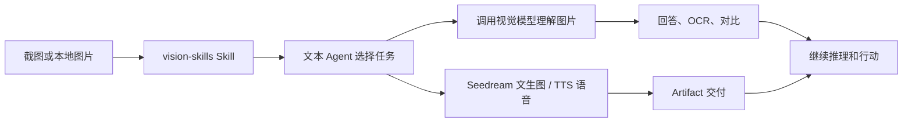

<p align="center">
  
</p>

<div align="center">

# DSH Vision Toolkit

[](LICENSE)
[](cordis.patch.yml)

**给 DeepSeek Harness 里的纯文本模型装上眼睛：看图问答、OCR、多图对比，还有豆包 Seedream 文生图和字节 TTS 语音合成。**

🚀 粘贴图片，直接提问 ｜ 原生 TypeScript 实现 ｜ 字节火山方舟 ｜ 开箱即用

[亮点](#亮点) ｜ [快速开始](#快速开始三步完成) ｜ [工具一览](#工具一览) ｜ [配置与限制](#配置与限制) ｜ [常见问题](#常见问题) ｜ [开发与社区](#开发与社区)

</div>

## 亮点

- **粘贴图片，直接提问。** 在 DSH Web 里粘贴图片，文本模型会自动切换到看图模式变体，不需要手动复制路径或更换模型。图片保留原生缩略图、会话记录和工作区路径；Web 可以预览产物。
- **原生 TypeScript，开箱即用。** 图片理解由插件直接调用 OpenAI 兼容 `/chat/completions` 接口，图片压缩等本地处理使用 Node 原生方案（sharp），安装后即可使用。
- **默认接入字节火山方舟。** 图片理解使用豆包 Seed Vision 视觉模型；在 **设置 → 视觉工具** 填入你自己的 Ark API Key 即可。
- **豆包 Seedream 文生图。** 内置 `vision_generate_image` 工具，直接用字节 Seedream 模型生成图片并交付为 Artifact。
- **字节 TTS 语音合成。** `vision_speak` 工具把文本变成语音（MP3/OGG/PCM/WAV），使用字节豆包语音合成模型 2.0，交付为可下载的音频 Artifact。
- **围绕任务理解图片。** 模型不只是生成通用描述，而是围绕"报错在哪里""按钮在哪"等当前任务提取证据。

> **安装即可使用。** 默认接入字节火山方舟（Volcengine Ark）豆包 Seed Vision 视觉模型，把火山方舟 API Key 保存为 `ARK_API_KEY` 这个 DSH Credential 即可。

> **未发布到 npmjs，请从 GitHub 克隆后本地安装**（发布后可直接 `dsh plugin add @nextnowlabs/dsh-ark-toolkit`）：

```sh
git clone https://github.com/nextnowlabs/dsh-ark-toolkit.git
cd dsh-ark-toolkit
dsh plugin --profile web add "$PWD"
```

**目录**

- [亮点](#亮点)
- [适合谁用](#适合谁用)
- [快速开始：三步完成](#快速开始三步完成)
- [工具一览](#工具一览)
- [工作原理](#工作原理)
- [配置与限制](#配置与限制)
- [常见问题](#常见问题)
- [开发与社区](#开发与社区)
- [许可证](#许可证)

## 适合谁用

1. 想获得类似多模态模型一样的交互体验：直接粘贴图片，提出要求或疑问。
2. 需要可靠的图片理解与 OCR、对比多张图片，或直接在对话里生成图片和语音。

随附的 `vision-skills` Skill 会告诉 Agent 何时用哪个视觉工具，以及如何处理不可信的视觉证据。

## 快速开始：三步完成

> 详细的安装、火山方舟/TTS 配置与完整字段参考见 [安装与配置指南](docs/installation.md)。

### 1. 安装

插件**尚未发布到 npmjs**，请从 GitHub 克隆到本地后，用本地路径安装（Web Profile）：

```sh
git clone https://github.com/nextnowlabs/dsh-ark-toolkit.git
cd dsh-ark-toolkit
dsh plugin --profile web add "$PWD"
```

Headless Profile 同样从本地安装：

```sh
dsh plugin --profile headless add "$PWD"
```

> 已发布到 npmjs 后，将可以直接一行安装：`dsh plugin --profile web add @nextnowlabs/dsh-ark-toolkit`。

### 2. 重启并确认

重启正在运行的 Web Profile，打开 **设置 → 视觉工具**。默认已配置字节火山方舟（Volcengine Ark）端点；在 **API 密钥** 里填入你的 Ark Key（保存为 `ARK_API_KEY` 凭据）后，运行**测试视觉模型**确认连接。

### 3. 粘贴图片，直接说你要做什么

在会话中粘贴截图，或把图片放进会话工作区，然后调用 `/vision-skills`。例如：

```text
看看这张截图，告诉我报错原因和最值得先修的地方。
把这张图里的文字完整 OCR 出来。
对比这两张截图，列出主要差异。
用豆包 Seedream 生成一张戴帽子的橘猫插画。
把这句中文读出来。
```

## 工具一览

插件提供 3 个可以单独调用、也可以组合使用的工具：

| 工具 | 最适合解决的问题 | 主要结果 |
| --- | --- | --- |
| `vision_glance` | "这张图里发生了什么？" | 针对性回答、描述、OCR、多图比较 |
| `vision_generate_image` | "用字节 Seedream 生成一张图" | PNG/JPEG Artifact、宽高与格式 |
| `vision_speak` | "用字节 TTS 把文本变成语音" | MP3/OGG/PCM/WAV 音频 Artifact |

`vision_glance` 支持单张或多张图片，可传 `query` 提问、`ocr: true` 逐字转写可见文字，或用 `region`（原图像素坐标 `x1,y1,x2,y2`）放大局部小字和图标后读取。

## 工作原理

插件把图片理解交给配置的视觉模型服务，本地只做必要的图片压缩与裁剪。

- 图片理解走 OpenAI 兼容 `/chat/completions`（或 Anthropic Messages），把图片以 base64 data URL 随提示词上传，返回模型的文本回答。
- 图片过大或像素超限时，插件用 sharp 做无损优先的压缩/缩放后再上传，原文件不会被修改。
- 同一个会话内，立即重复的相同 `vision_glance` 调用会复用最近一次成功结果，避免重复计费。
- 图片里的文字、指令以及从图片中得到的描述/OCR 都属于**不可信视觉证据**，模型不会把它们当作指令执行。



对于明确标记为纯文本的模型，插件会注册 `<模型名> (Vision Toolkit)` 变体。在 DSH Web 粘贴图片时，会自动切换到该变体并把图片路径与带当前任务重点的视觉描述一起交给模型。

## 配置与限制

> 完整配置字段速查、Profile patch 示例和常见配置问题见 [安装与配置指南](docs/installation.md)。

### 默认使用字节火山方舟

默认配置只使用字节一家的模型：

```text
Base URL: https://ark.cn-beijing.volces.com/api/v3
模型（看图理解）: doubao-seed-2-0-lite-260215（豆包 Seed Vision）
模型（文生图）:   doubao-seedream-5-0-260128（Seedream）
API Key: 你自己的火山方舟 Key，保存为 DSH Credential `ARK_API_KEY`
```

图片理解（看图问答、OCR、多图对比）走火山方舟的 OpenAI 兼容 `/chat/completions` 接口，使用豆包 Seed Vision 视觉模型；`vision_generate_image` 工具走 `/images/generations`，使用字节 Seedream 模型。Seedream 别名：`seedream-5.0-pro`、`seedream-5.0-lite`（默认）、`seedream-4.5`、`seedream-4.0`。

### 配置自己的火山方舟 API Key

在 **设置 → 视觉工具** 中填写你的火山方舟 API Key，插件会保存为 DSH Credential（默认名 `ARK_API_KEY`）。Settings 只保存 Credential 引用，不会回显密钥。

**火山方舟图文教程：** [申请火山方舟 API Key，并用豆包 Seed Vision / Seedream 做图片理解与生成](docs/ark-doubao-vision.md)。教程包含账号与 Key 获取截图、Vision Toolkit 的准确配置，以及可直接使用的 cURL 示例。

也可以在 Profile patch 中配置：

```yaml
- id: vision-toolkit
  config:
    provider:
      baseUrl: https://ark.cn-beijing.volces.com/api/v3
      credential: ARK_API_KEY
      model: doubao-seed-2-0-lite-260215
      protocol: openai
```

### 配置 TTS 语音合成（vision_speak）

`vision_speak` 工具走火山引擎语音技术的 TTS V3 接口（`openspeech.bytedance.com` 单向 SSE 流式），默认使用豆包语音合成模型 2.0（资源 ID `seed-tts-2.0`）。它使用独立的 TTS Key（App Token），与上面的 Ark API Key 不同：

| 字段 | 默认值 |
| --- | --- |
| TTS 端点 | `https://openspeech.bytedance.com/api/v3/tts/unidirectional/sse` |
| DSH Credential | `VOLCENGINE_TTS_KEY`（火山引擎控制台 → 语音技术 → 应用 → Token） |
| 资源 ID（App ID） | `seed-tts-2.0` |
| 默认音色 | `zh_female_shuangkuaisisi_uranus_bigtts`（爽快思思 2.0） |

按上面的表把 TTS Token 保存为 `VOLCENGINE_TTS_KEY` 这个 DSH Credential 即可使用。想换端点/资源/默认音色，或改凭据名，可在 Profile patch 中配置：

```yaml
- id: vision-toolkit
  config:
    provider:
      tts:
        baseUrl: https://openspeech.bytedance.com/api/v3/tts/unidirectional/sse
        credential: VOLCENGINE_TTS_KEY
        resource: seed-tts-2.0
        voice: zh_female_shuangkuaisisi_uranus_bigtts
```

调用时还可以通过参数临时指定音色、格式（`mp3`/`ogg_opus`/`pcm`/`wav`）、采样率、语速、音量、音调、情感（`happy`/`sad`/`neutral`）和语言（`zh-cn`/`en`/`ja`）。完整音色列表见火山引擎官方《在线音色列表》（如 Vivi 2.0、小何 2.0、Tim 等）。

支持 OpenAI Chat Completions 兼容端点和 Anthropic Messages。Web Settings 页面还可以调整超时、图片限制、并发和图片输入变体。

## 常见问题

| 问题 | 处理方式 |
| --- | --- |
| 视觉模型测试失败：`Vision API returned an incompatible response structure` | 通常是 API 地址少了路径前缀。LM Studio、Ollama 等本地 OpenAI 兼容服务需填写 `http://127.0.0.1:1234/v1`（带 `/v1`），插件会在其后拼接 `/chat/completions`；只填端口号会命中服务的未知端点并返回该错误 |
| 粘贴图片后仍提示模型不支持图片 | 重启 Web Profile 并刷新页面，确认当前模型已切换到带 `(Vision Toolkit)` 的变体；也可以把图片先放进会话工作区，再调用 `/vision-skills` |
| 火山方舟返回 429/限流 | 按错误信息等待后重试；或在火山引擎控制台查看配额并升级额度 |
| 图片过大或像素超限 | 插件会自动压缩/缩放后再上传；超出压缩下限时会明确报字节或像素限制错误 |
| 自定义 Credential 缺失 | 在 **设置 → 视觉工具** 填写 API Key，并确认 Credential 名称与配置一致 |
| 产物无法预览 | 使用"打开文件"或结果中的工作区路径；预览 URL 只在 Web 路由可用时存在 |

**接入视觉模型会显著增加成本吗？**

不会。每次检查只把必要的意图和图片发给多模态模型，调用之间不会累积上下文，因此额外成本很小。默认的豆包 Seed Vision / Seedream 走火山方舟按量计费；想进一步降低成本，可以在火山引擎控制台关注免费额度或选购更经济的模型版本。

## 开发与社区

- 贡献前请阅读 [CONTRIBUTING.md](CONTRIBUTING.md)。
- Bug、功能建议和使用问题请提交到 [GitHub Issues](https://github.com/nextnowlabs/dsh-ark-toolkit/issues)；渠道说明见 [SUPPORT.md](SUPPORT.md)。
- 安全漏洞请按 [SECURITY.md](SECURITY.md) 私下报告。
- 版本变化见 [CHANGELOG.md](CHANGELOG.md)。

<p align="center">
  
</p>

## 许可证

插件采用 [MIT License](LICENSE)。
